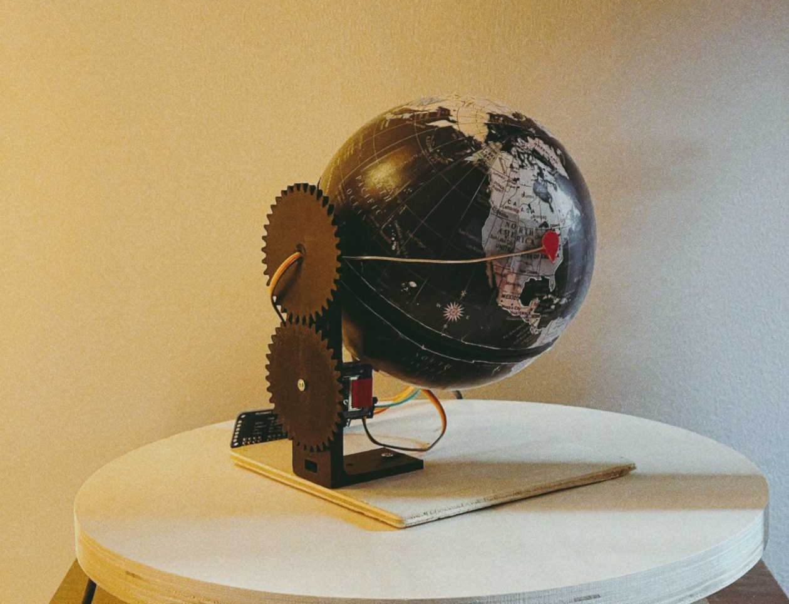

# 🌍 RoboGlobe

A 2-axis robotic globe controller powered by ESP32 that points a physical globe to any location on Earth via HTTP API.



## Features

- **WiFi Provisioning**: Automatic captive portal for easy WiFi setup
- **HTTP REST API**: Control the globe via simple HTTP requests
- **Point Animation**: Animate through multiple locations with configurable timing and repeats
- **mDNS Support**: Access device via friendly hostname (e.g., `roboglobe-1838.local`)
- **Persistent Configuration**: WiFi credentials and servo calibration stored in non-volatile memory
- **Dual Operating Modes**: 
  - **AP Mode**: Provisioning interface when no WiFi configured
  - **STA Mode**: Normal operation connected to your network
- **Servo Calibration**: Per-servo calibration for precise positioning
- **Modern Web UI**: Beautiful provisioning interface with network scanning

## Hardware Requirements

- **ESP32 DevKit V1** (or compatible ESP32 board)
- **PCA9685** I2C PWM driver board
- **2× SG90 servos** (or compatible servos)
- **External 5V power supply** for servos (PCA9685 can be powered via USB, but servos need separate supply)
- **I2C connections**:
  - SDA: GPIO 21
  - SCL: GPIO 22
  - PCA9685 address: `0x40` (default)

### Servo Channels

| Function | PCA9685 Channel |
|----------|----------------|
| Latitude (tilt) | 0 |
| Longitude (rotation) | 1 |

## Installation

### Prerequisites

- [PlatformIO](https://platformio.org/) installed
- USB cable for ESP32
- Access to WiFi network for provisioning

### Building and Uploading

1. **Clone the repository**:
   ```bash
   git clone <repository-url>
   cd roboglobe
   ```

2. **Build the firmware**:
   ```bash
   pio run -e esp32dev
   ```

3. **Upload firmware to ESP32**:
   ```bash
   pio run -e esp32dev -t upload
   ```

4. **Upload filesystem (SPIFFS)** - **IMPORTANT**:
   ```bash
   pio run -e esp32dev -t uploadfs
   ```
   This uploads the provisioning web interface. Without this, you'll only see a basic fallback page.

5. **Monitor serial output** (optional):
   ```bash
   pio device monitor
   ```

## WiFi Provisioning

### First-Time Setup

1. **Power on the ESP32** - it will create a WiFi access point named `ROBOGLOBE-XXXX` (where XXXX is the chip ID)

2. **Connect to the network** from your phone/computer:
   - Network name: `ROBOGLOBE-XXXX`
   - Password: (none - open network)
   - The captive portal should automatically open in your browser

3. **If the portal doesn't open automatically**, navigate to:
   - `http://192.168.4.1` (default AP IP)
   - Or `http://roboglobe-XXXX.local` (mDNS hostname)

4. **Select your WiFi network** from the scan list or enter manually

5. **Enter your WiFi password** and click "Connect"

6. **Device will reboot** and connect to your network

### Accessing the Device

Once provisioned, the device will:
- Connect to your WiFi network automatically on boot
- Be accessible via hostname: `http://roboglobe-XXXX.local`
- Be accessible via IP address (check your router's DHCP client list or serial monitor)

### Re-provisioning

To reset WiFi credentials and return to provisioning mode:

```bash
curl -X POST http://roboglobe-XXXX.local/reset-wifi
```

Or use the API from any device on the network. The device will reboot into AP mode.

## API Documentation

All endpoints return JSON. Base URL is the device's IP address or hostname.

### `GET /health`

Get device status and information.

**Response:**
```json
{
  "status": "ok",
  "mode": "sta",
  "ip": "192.168.1.42",
  "uptime_ms": 123456
}
```

### `POST /point`

Point the globe to a specific latitude/longitude.

**Request:**
```json
{
  "lat": 41.8781,
  "lng": -87.6298
}
```

**Response:**
```json
{
  "lat": 41.8781,
  "lng": -87.6298,
  "lat_servo_deg": 131.9,
  "lng_servo_deg": 136.2
}
```

**Validation:**
- Latitude: `-90` to `+90`
- Longitude: `-180` to `+180` (or `0` to `360`)

### `GET /point?lat=41.8781&lng=-87.6298`

Query-string variant of `/point` endpoint.

### `POST /points`

Animate the globe through a sequence of points with configurable timing and repeats.

**Request:**
```json
{
  "points": [
    {"lat": 40.7128, "lng": -74.0060},
    {"lat": 51.5074, "lng": -0.1278},
    {"lat": 35.6762, "lng": 139.6503}
  ],
  "interval_ms": 2000,
  "repeats": 3
}
```

**Parameters:**
- `points` (required): Array of point objects, each with `lat` and `lng` fields
- `interval_ms` (optional): Time in milliseconds to wait between points after the servo movement completes (default: 1000ms, minimum: 100ms)
- `repeats` (optional): Number of times to repeat the entire sequence (default: 1, minimum: 1)

**Response:**
```json
{
  "status": "started",
  "points": 3,
  "interval_ms": 2000,
  "repeats": 3
}
```

**Behavior:**
- The globe moves smoothly to each point in sequence (1500ms movement duration)
- After reaching each point, waits for the specified `interval_ms` before moving to the next point
- When all points are reached, repeats the sequence `repeats` times
- Animation runs asynchronously - the API returns immediately after starting
- If a new `/points` request is received while an animation is running, it will stop the current animation and start the new one

**Validation:**
- All points must have valid `lat` and `lng` fields
- Latitude: `-90` to `+90`
- Longitude: `-180` to `+180` (or `0` to `360`)
- Points array cannot be empty

### `GET /state`

Get the last commanded position and calibration settings.

**Response:**
```json
{
  "last_lat": 41.8781,
  "last_lng": -87.6298,
  "last_lat_servo_deg": 131.9,
  "last_lng_servo_deg": 136.2,
  "uptime_ms": 123456,
  "calibration_lat": {
    "pulse_min_us": 500,
    "pulse_max_us": 2500,
    "invert": false,
    "offset_deg": 0.0
  },
  "calibration_lng": {
    "pulse_min_us": 500,
    "pulse_max_us": 2500,
    "invert": false,
    "offset_deg": 0.0
  }
}
```

### `POST /calibrate`

Update servo calibration parameters.

**Request:**
```json
{
  "channel": 0,
  "pulse_min_us": 500,
  "pulse_max_us": 2500,
  "invert": false,
  "offset_deg": 0.0
}
```

**Parameters:**
- `channel`: `0` (latitude) or `1` (longitude)
- `pulse_min_us`: Minimum pulse width in microseconds (default: 500)
- `pulse_max_us`: Maximum pulse width in microseconds (default: 2500)
- `invert`: Invert servo direction (default: false)
- `offset_deg`: Offset in degrees (default: 0.0)

### `POST /reset-wifi`

Clear stored WiFi credentials and reboot into AP mode.

**Response:**
```json
{
  "status": "ok",
  "message": "Wi-Fi credentials cleared, rebooting..."
}
```

### `GET /i2c-scan`

Scan the I2C bus for connected devices. Useful for diagnosing I2C address issues.

**Response:**
```json
{
  "devices": [
    {
      "address": "0x40",
      "address_dec": 64,
      "type": "PCA9685 (default)",
      "is_pca9685": true
    }
  ],
  "count": 1,
  "expected_address": "0x40",
  "found_pca9685": true
}
```

**Usage:**
```bash
curl http://roboglobe-XXXX.local/i2c-scan
```

This will show all I2C devices found on the bus. If your PCA9685 is at a different address than expected (0x40), you'll see it listed here. Common PCA9685 addresses are 0x40-0x47 depending on address jumper configuration.

### `GET /scan` (AP Mode Only)

Scan for available WiFi networks. Only available when device is in AP mode.

**Response:**
```json
{
  "networks": [
    {
      "ssid": "MyNetwork",
      "rssi": -45,
      "channel": 6,
      "encryption": true,
      "encryption_type": "WPA2",
      "hidden": false
    }
  ],
  "count": 1
}
```

## Usage Examples

### Point to Chicago

```bash
curl -X POST http://roboglobe-1838.local/point \
  -H "Content-Type: application/json" \
  -d '{"lat": 41.8781, "lng": -87.6298}'
```

### Point to Tokyo

```bash
curl -X POST http://roboglobe-1838.local/point \
  -H "Content-Type: application/json" \
  -d '{"lat": 35.6762, "lng": 139.6503}'
```

### Animate Through Multiple Cities

```bash
curl -X POST http://roboglobe-1838.local/points \
  -H "Content-Type: application/json" \
  -d '{
    "points": [
      {"lat": 40.7128, "lng": -74.0060},
      {"lat": 51.5074, "lng": -0.1278},
      {"lat": 35.6762, "lng": 139.6503},
      {"lat": -33.8688, "lng": 151.2093}
    ],
    "interval_ms": 3000,
    "repeats": 2
  }'
```

This will animate through New York, London, Tokyo, and Sydney, waiting 3 seconds at each location, and repeat the sequence twice.

### Check Device Status

```bash
curl http://roboglobe-1838.local/health
```

### Get Current Position

```bash
curl http://roboglobe-1838.local/state
```

### Calibrate Latitude Servo

```bash
curl -X POST http://roboglobe-1838.local/calibrate \
  -H "Content-Type: application/json" \
  -d '{
    "channel": 0,
    "pulse_min_us": 500,
    "pulse_max_us": 2500,
    "invert": false,
    "offset_deg": 5.0
  }'
```

## Coordinate Mapping

### Latitude (Tilt)
- Maps linearly from `-90°` (South Pole) to `+90°` (North Pole)
- Servo range: `0°` to `180°`
- Formula: `servo_angle = ((lat + 90) / 180) * 180`

### Longitude (Rotation)
- Maps with 2:1 gear ratio (globe rotates 360°, servo rotates 180°)
- Handles both `-180° to +180°` and `0° to 360°` formats
- Formula: `servo_angle = ((lng + 360) % 360) / 2`

## Project Structure

```
roboglobe/
├── data/
│   └── index.html          # Provisioning web interface
├── src/
│   ├── main.cpp            # Entry point, initialization
│   ├── wifi_manager.cpp/h  # WiFi AP/STA management
│   ├── http_api.cpp/h      # HTTP server and endpoints
│   ├── config_store.cpp/h  # NVS persistence
│   ├── globe_mapping.cpp/h # Coordinate to servo angle conversion
│   └── servo_driver.cpp/h  # PCA9685 and servo control
├── platformio.ini           # PlatformIO configuration
└── README.md               # This file
```

## Troubleshooting

### Provisioning page shows "RoboGlobe Provisioning" fallback

**Solution**: Upload the SPIFFS filesystem:
```bash
pio run -e esp32dev -t uploadfs
```

### Device doesn't appear on network after provisioning

1. Check serial monitor for connection status and IP address
2. Verify WiFi credentials are correct
3. Check router's DHCP client list
4. Try accessing via IP address instead of hostname
5. Ensure mDNS is supported on your network (for `.local` hostname)

### Can't find the AP network

1. Check serial monitor - device may have successfully connected to stored network
2. If credentials exist, device boots directly into STA mode
3. Use `/reset-wifi` endpoint to force AP mode

### "Failed to set latitude servo" or "Servo driver not initialized" error

This error indicates the PCA9685 servo driver board is not being detected. **This is the most common issue on first setup.**

**Initial Hardware Setup Checklist:**

1. **I2C Wiring** (CRITICAL):
   - ESP32 GPIO 21 → PCA9685 SDA
   - ESP32 GPIO 22 → PCA9685 SCL
   - ESP32 GND → PCA9685 GND
   - ESP32 5V or 3.3V → PCA9685 VCC (check your PCA9685 board - some need 5V, some work with 3.3V)
   - **Pull-up resistors**: Most PCA9685 boards have built-in pull-ups. If not, add 4.7kΩ resistors from SDA/SCL to VCC

2. **Power Supply**:
   - PCA9685 needs power (5V recommended, some work with 3.3V)
   - Servos need separate 5V power supply (connect to PCA9685 V+ terminal)
   - **Do NOT power servos from ESP32 USB** - they draw too much current

3. **I2C Address**:
   - Default address is `0x40`
   - If using address jumpers, verify the address matches

4. **Check Serial Monitor** (115200 baud):
   - Look for "ERROR: PCA9685 not found" message
   - The error code will help diagnose:
     - `2`: NACK on transmit (device not responding - check wiring/power)
     - `3`: NACK on data (address conflict or device issue)
     - `4`: Other error (check I2C bus)
   - **I2C scan runs automatically** when PCA9685 is not found - check the scan results!

5. **Use I2C Scan Endpoint**:
   ```bash
   curl http://roboglobe-XXXX.local/i2c-scan
   ```
   This will show all devices on the I2C bus. If PCA9685 is found at a different address (e.g., 0x41 instead of 0x40), you'll see it listed here.

6. **If PCA9685 is at wrong address**:
   - Check the I2C scan results to see what address it's actually at
   - Update `PCA9685_ADDRESS` in `src/servo_driver.h` to match
   - Rebuild and upload firmware
   - Or adjust the address jumpers on your PCA9685 board to match 0x40

7. **Verification Steps**:
   ```bash
   # Check if servo driver is initialized
   curl http://roboglobe-XXXX.local/health
   # Look for "servo_initialized": true
   
   # Scan I2C bus to see all devices
   curl http://roboglobe-XXXX.local/i2c-scan
   ```

### Servos not moving (but driver initialized)

1. Verify servo connections to PCA9685 channels:
   - Latitude servo → Channel 0
   - Longitude servo → Channel 1
2. Check servo power supply (separate 5V supply required)
3. Calibrate servos using `/calibrate` endpoint
4. Test with `/state` endpoint to verify angles are being calculated

### mDNS hostname not resolving

- Some networks/routers don't support mDNS
- Use IP address instead (check serial monitor or router DHCP list)
- On Linux, may need `avahi-daemon` or `nss-mdns`
- On Windows, mDNS support is built-in (Windows 10+)

## Serial Monitor Output

The device prints useful information to serial (115200 baud):

**Successful initialization:**
```
=== RoboGlobe Firmware ===
Initializing...
NVS initialized
Initializing servo driver...
I2C pins: SDA=21, SCL=22
PCA9685 address: 0x40
PCA9685 initialized successfully
✓ Servo driver initialized successfully
Wi-Fi Mode: STA
SSID: YourNetwork
IP Address: 192.168.1.42
=== Initialization Complete ===
HTTP server ready
Access the device at: http://192.168.1.42
```

**If servo driver fails to initialize:**
```
=== RoboGlobe Firmware ===
Initializing...
NVS initialized
Initializing servo driver...
I2C pins: SDA=21, SCL=22
PCA9685 address: 0x40
ERROR: PCA9685 not found at address 0x40 (I2C error: 2)
Troubleshooting:
  1. Check I2C wiring: SDA->GPIO21, SCL->GPIO22
  2. Verify PCA9685 is powered (5V)
  3. Check I2C address jumpers (default: 0x40)
  4. Verify pull-up resistors on SDA/SCL (usually 4.7kΩ)
WARNING: Failed to initialize servo driver
The device will continue but /point endpoint will return errors.
Please check hardware connections and restart after fixing.
Wi-Fi Mode: STA
...
```

## Default Settings

- **HTTP Port**: 80
- **PWM Frequency**: 50 Hz
- **PCA9685 Address**: 0x40
- **I2C Pins**: SDA=21, SCL=22
- **Servo Channels**: Latitude=0, Longitude=1
- **AP SSID Format**: `ROBOGLOBE-XXXX`
- **Hostname Format**: `roboglobe-XXXX.local`

## License

[Add your license here]

## Contributing

[Add contribution guidelines here]

## Acknowledgments

Built with:
- [PlatformIO](https://platformio.org/)
- [ESPAsyncWebServer](https://github.com/me-no-dev/ESPAsyncWebServer)
- [ArduinoJson](https://arduinojson.org/)
- [Adafruit PWM Servo Driver Library](https://github.com/adafruit/Adafruit-PWM-Servo-Driver-Library)
